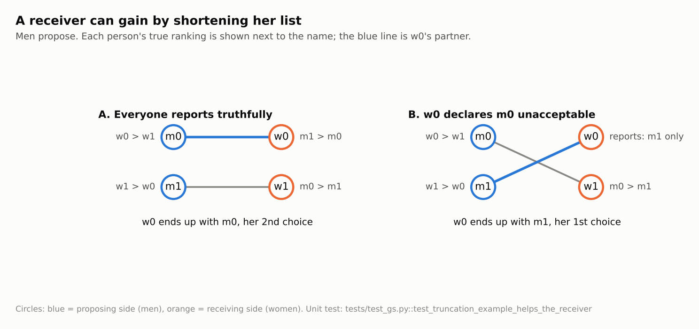
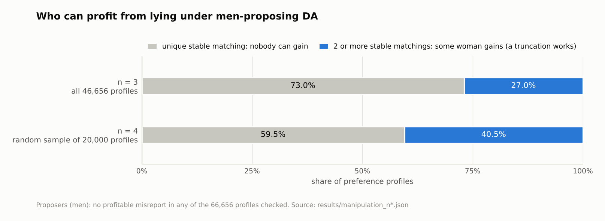
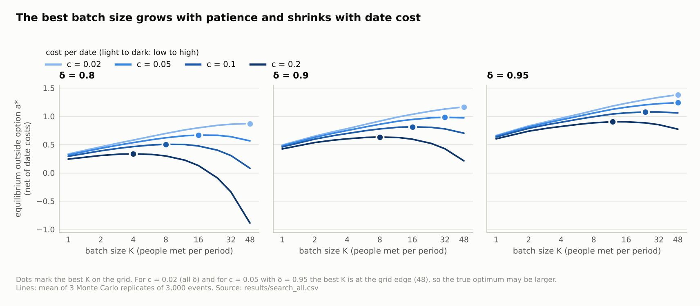
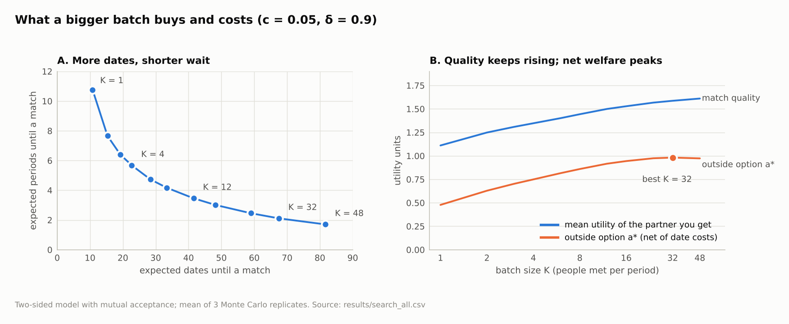
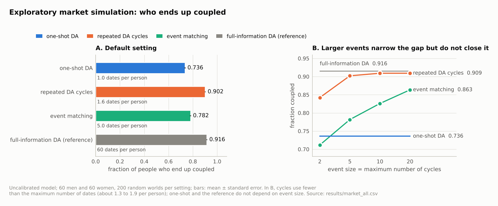

# stable-matching-lab

Small experiments around the Gale–Shapley deferred acceptance (DA) algorithm [1],
motivated by Singapore's FirstDate government dating pilot, which matches
people from a questionnaire using DA [16]. Everything here is a model or an
enumeration: the numbers say what happens under the stated assumptions, not
what happens in any real service.

Three pieces:

1. **Manipulation explorer** – brute-force every possible misreport of one
   agent and check who can profit under men-proposing DA.
2. **Costly search with batch dating** – a stationary two-sided search model in
   which the outside option is determined inside the model rather than set by
   hand, used to ask how many people one should meet per period.
3. **Exploratory market simulation** – an earlier, uncalibrated simulation that
   compares one-shot DA, repeated DA cycles and event matching.

Open questions and planned extensions are listed under [Future work](#future-work).
Numbers in square brackets refer to the [References](#references).

## Layout

```
stablematch/gs.py        DA with incomplete lists, blocking pairs, brute-force
                         stable matchings, many-to-one DA
stablematch/explore.py   misreport search                        (section 1)
stablematch/search.py    costly-search model and equilibrium     (section 2)
stablematch/market.py    exploratory market simulation           (section 3)
experiments/             scripts that produce results/
results/                 saved outputs (JSON / Markdown / CSV)
docs/figures/            figures used below, drawn from results/ only
tests/                   pytest
```

Reproduce (Python 3.10+, `numpy`, `pytest`, `matplotlib` for figures):

```
pip install -r requirements.txt
python -m pytest
python experiments/run_manipulation.py 3            # all 46,656 profiles
python experiments/run_manipulation.py 4 20000 0    # 20,000 random profiles, seed 0
python experiments/run_search.py 3000 3             # about 15 minutes on 2 cores
python experiments/run_market.py 200                # 200 random worlds per row
python experiments/make_figures.py                  # redraws docs/figures from results/
```

## 1. Who can profit from lying?

Setup: n men and n women, strict complete true preferences, men-proposing DA.
For each agent we try every ordered list built from any subset of the other
side (so truncations and permutations), and ask whether the true partner rank
improves. Being unmatched counts as worst.



*Figure 1. The smallest case where a receiver gains by truncation (checked by a unit test).*

| n | profiles | some man can gain | some woman can gain | gaining woman has a truncation that works | profiles with a unique stable matching | gaining woman while the stable matching is unique |
|---|---|---|---|---|---|---|
| 3 | 46,656 (all) | 0 | 12,576 (27.0%) | 12,576 | 34,080 (73.0%) | 0 |
| 4 | 20,000 (random sample) | 0 | 8,093 (40.5%) | 8,093 | 11,907 (59.5%) | 0 |



*Figure 2. The same numbers as the table, as shares of profiles.*

What this shows, for these sizes only:

* No proposer ever gained by misreporting. This is in line with the known
  result that DA is strategy-proof for the proposing side [2, 3], and it is
  also a check on the implementation.
* Receivers sometimes can gain [3]. In every profile where a receiver gains, a
  truncation of her true list is enough, and every profile with more than one
  stable matching had a gaining receiver. When the stable matching is unique
  nobody gained. Truncation strategies are studied in [10, 11]; this
  enumeration is not a replication of either paper.
* Smallest example (m0: w0>w1, m1: w1>w0, w0: m1>m0, w1: m0>m1): truthful DA
  gives (m0,w0),(m1,w1); if w0 declares m0 unacceptable she ends up with m1,
  her true first choice. This is a unit test.

Full distributions (by number of stable matchings, by number of gaining
receivers) are in `results/manipulation_n*.json`.

## 2. Costly search with batch dating

**Question.** If every date costs something and match quality is only revealed
on the date, how many people should one meet per period, and what does the
outside option look like once it is determined by the market instead of
assumed?

**Model** (`stablematch/search.py`, stationary and symmetric):

* Each period every single person attends an event with K men and K women and
  meets all K people of the other sex. K = 1 is one date at a time; larger K
  is "match people to a group event". A date costs `c`.
* The utility of a pair is an independent N(0, 1) draw per person, revealed on
  the date.
* A pair forms only if both utilities are at least a threshold `a`. Inside an
  event, mutually acceptable pairs are matched by men-proposing DA on the true
  utilities (the result is stable within the event; tested).
* A match is permanent and pays the utility every later period, discounted by
  `delta`. Matched people leave and are replaced by identical new singles.
* With p the per-period probability of being matched and g = E[u · 1{matched}],
  the value of being single satisfies V = −cK + δ(g/(1−δ) + (1−p)V). A person
  accepts a partner iff u/(1−δ) ≥ V, so the threshold is **a = (1−δ)V**. That
  fixed point is the equilibrium outside option; it is also the welfare measure
  reported below (net of date costs).

Setup of the grid: c ∈ {0.02, 0.05, 0.1, 0.2}, δ ∈ {0.8, 0.9, 0.95}, K up to
48 (Monte Carlo, 3 replicates of 3,000 events each). A one-sided benchmark
(every partner accepts anyone, you pick the best of your K dates) is solved by
quadrature for K up to 512.

**Checks.** `tests/test_search.py` compares the simulation with closed forms:
the K = 1 two-sided match probability and utility agree with q² and q·φ(a)
(q = 1 − Φ(a)) within 0.01; the K = 1 one-sided fixed point satisfies the
McCall-type condition a + c = δ/(1−δ) · E[(u−a)⁺] [5]. In the full grid the
Monte Carlo K = 1 thresholds are 0.011 to 0.022 below the exact K = 1
solution; the replicates share random draws across settings, so these errors
are correlated.

**Results** (`results/search_summary.md` has every row, including dates and
periods to a match and the partner utility):

| c | δ | K\* (two-sided) | a at K\* | a at K = 1 (exact) | K\* (one-sided) |
|---|---|---|---|---|---|
| 0.02 | 0.8 | ≥ 48 (grid edge) | 0.872 | 0.345 | 64 |
| 0.02 | 0.9 | ≥ 48 (grid edge) | 1.166 | 0.512 | 128 |
| 0.02 | 0.95 | ≥ 48 (grid edge) | 1.382 | 0.679 | 256 |
| 0.05 | 0.8 | 16 | 0.668 | 0.329 | 32 |
| 0.05 | 0.9 | 32 | 0.981 | 0.500 | 64 |
| 0.05 | 0.95 | ≥ 48 (grid edge) | 1.241 | 0.669 | 96 |
| 0.1 | 0.8 | 8 | 0.505 | 0.304 | 16 |
| 0.1 | 0.9 | 16 | 0.813 | 0.480 | 32 |
| 0.1 | 0.95 | 24 | 1.078 | 0.653 | 48 |
| 0.2 | 0.8 | 4 | 0.335 | 0.255 | 8 |
| 0.2 | 0.9 | 8 | 0.633 | 0.442 | 16 |
| 0.2 | 0.95 | 12 | 0.904 | 0.623 | 24 |



*Figure 3. Equilibrium outside option against batch size (two-sided model). Dots are the K\* column above.*



*Figure 4. One cell of the grid (c = 0.05, δ = 0.9): bigger batches shorten the wait but cost more dates; net value peaks at K = 32.*

* In every setting there is a batch size above one that gives a higher
  equilibrium outside option than meeting one person at a time.
* The best batch size K\* rises with patience δ and falls with the date cost c.
* Mutual acceptance is costly: the two-sided threshold is 0.29 to 0.89 below
  the one-sided benchmark at the same K, and the two-sided K\* is never larger
  than the one-sided one.
* A bigger batch trades dates for time. At c = 0.05, δ = 0.9, expected dates
  per match rise from 10.8 (K = 1) to 67.5 (K = 32) while expected periods to a
  match fall from 10.8 to 2.1, and the partner's utility rises from 1.11 to
  1.59.
* Oversized events hurt when dates are costly: at c = 0.2, δ = 0.8 the
  threshold falls from 0.25 (K = 1, exact) to −0.09 at K = 24 and −0.89 at K = 48 (Monte Carlo).

**What this does and does not say.**

* Whether meeting many people at once beats one date at a time depends on the
  ratio of the date cost to the spread of match utilities and on patience.
  The model gives no universal answer.
* It contains no questionnaire or other screening information, so it does not
  compare matching people with matching events; that is listed as future work.
* The within-event rule is DA. Other rules were not tested, so the results do
  not say how much stability itself matters.
* The structure is the usual stationary search set-up with a reservation
  threshold [5], extended to two sides with mutual acceptance [7, 9]. I did
  not check the results against those papers' propositions.
* All agents are identical and utilities are independent, so there is no
  sorting or heterogeneity [8]; matches are permanent; everyone reports
  truthfully inside an event. The grid values of `c` and `delta` are not
  calibrated to any data.

## 3. Exploratory market simulation (uncalibrated)

An earlier model in `stablematch/market.py`. It has heterogeneous agents, but
its outside option is a quantile of each agent's own utilities (exogenous) and
dates are free; section 2 relaxes those two choices in a simpler population.

Model: 60 men and 60 women with trait vectors and a common "appeal" score.
True utility is trait similarity + `lam` × appeal + idiosyncratic taste that is
only revealed on a date. The questionnaire sees the first two parts plus noise
(`sigma_q`). Each person only commits to someone above their outside option
(the `outside_q` quantile of their own utilities). There is no commitment: a
pair that does not both clear the bar stays single.

Mechanisms:

* `one_shot` – one run of DA on questionnaire scores, then dates.
* `cycles` – repeated DA among people still single, never repeating a pair.
* `events` – assign people to events by trait affinity (many-to-one DA); inside
  an event everyone meets everyone and pairs form by DA on true utility.
* `oracle` – DA on true utilities. Needs n² dates; only a reference.

Defaults (200 random worlds, mean ± standard error):

| mechanism | fraction coupled | dates / person | blocking pairs / person |
|---|---|---|---|
| one_shot | 0.736 ± 0.004 | 1.0 | 3.94 ± 0.05 |
| cycles | 0.902 ± 0.002 | 1.6 | 2.83 ± 0.03 |
| events (5 per event) | 0.782 ± 0.003 | 5.0 | 2.56 ± 0.04 |
| oracle | 0.916 ± 0.002 | 60 | 0 |



*Figure 5. Same simulation as the table (uncalibrated; do not read the levels as predictions).*

A "blocking pair" here is a man and woman, not together, who each have higher
true utility for the other than for their current partner (or their outside
option if single).

What the sweeps in `results/market_summary.md` show:

* Repeated cycles give the highest fraction coupled among the feasible
  mechanisms in every setting tried, and come close to the oracle at default
  parameters (0.902 vs 0.916) with about 1.6 dates per person.
* `events` improve as events get larger (fraction coupled 0.712 / 0.782 /
  0.826 / 0.863 for 2 / 5 / 10 / 20 dates per person) but stay below `cycles`
  (0.909 at 10 or 20) in this model.
* Blocking pairs per person are mixed. `events` have fewer than `cycles` at
  the defaults, with 5 or more dates per person, and at `sigma_q` ≥ 0.5, but
  more at `lam` 1 or 2, `outside_q` 0.7 or 0.85, `sigma_e` 2, `sigma_q` 0.25
  and 2 dates per person (see the tables for every row).
* One-shot DA leaves many people single, and gets worse as the questionnaire
  gets noisier (0.765 → 0.523 coupled as `sigma_q` goes 0.25 → 2.0). Higher
  outside options lower the fraction coupled for every mechanism, the oracle
  included (0.960 → 0.582 from `outside_q` 0.3 to 0.85), because fewer pairs
  are mutually acceptable at all.

Caveats that matter when reading these numbers:

* Event assignment uses true trait vectors with no questionnaire noise, and
  event themes are random, so this is not a tuned event-matching design.
* "Mean utility of coupled" in the output tables is not comparable across
  mechanisms: a mechanism that couples fewer people can look better on it
  because of selection.
* Dates are not priced here, only counted. Every result depends on this
  model's functional forms and parameters; the sweeps vary one parameter at a
  time around the defaults.

## Future work

Not done yet; listed so that the gaps are explicit.

1. **Calibrate with real data.** Speed-dating data [12] and online-dating data
   [13] could be used to estimate the spread of match utilities, the shared
   "appeal" component, acceptance thresholds and date costs, and to check
   whether the implied best batch size is near real event sizes. Whether and
   under what terms those datasets can be obtained was not checked.
2. **Strategic behaviour.** Section 1 finds that profitable misreports by
   receivers are always truncations in these small cases; truncation under
   incomplete information is analysed in [10, 11]. In a questionnaire
   pipeline the participant reports answers, not a ranking, and the platform
   turns them into scores, so manipulation acts on the answers. Questions:
   what is the equilibrium of that reporting game, and how much welfare does
   it cost compared with the truthful benchmark?
3. **Screening information in the search model.** Let a platform pre-select
   partners (people matching, K = 1 draws from a better-than-random pool)
   versus assigning people to events (larger K, less targeted), and compare
   them in the section 2 framework. This is my own extension; no source.
4. **Heterogeneity and sorting.** Replace identical agents by types so that
   thresholds differ across agents, in the spirit of [8].
5. **Formal verification of the receiver-side manipulation.** A Lean 4
   development of DA exists [15]; per its README it covers complete preference
   lists only and includes the proposer-side result ("men shouldn't lie").
   Extending it to incomplete lists and formalising the receiver-side
   truncation example is an open option. An Isabelle development exists [14];
   whether either system covers incomplete lists or receiver-side
   manipulation beyond what is stated here was not checked. Worth asking on
   the Lean community Zulip before starting.

## References

Bibliographic details (authors, year, journal, volume, pages) were checked on
2026-10-08 and 2026-10-09 against publisher, RePEc, university or
author-hosted pages. The descriptions of what each paper shows are from my own
reading of titles and abstracts and general knowledge, not from the full
texts, and should be checked before being cited.

1. D. Gale and L. S. Shapley, "College Admissions and the Stability of
   Marriage", *The American Mathematical Monthly* 69(1), 1962, 9–15.
2. L. E. Dubins and D. A. Freedman, "Machiavelli and the Gale–Shapley
   Algorithm", *The American Mathematical Monthly* 88, 1981, 485–494. (Issue
   number not seen on the page used.)
3. A. E. Roth, "The Economics of Matching: Stability and Incentives",
   *Mathematics of Operations Research* 7(4), 1982, 617–628. (Read from an
   author-hosted PDF with poor text recognition; the page range was read
   from running page numbers.)
4. D. E. Knuth, *Mariages stables et leurs relations avec d'autres problèmes
   combinatoires*, Les Presses de l'Université de Montréal, 1976; English
   translation *Stable Marriage and Its Relation to Other Combinatorial
   Problems*, American Mathematical Society, CRM Proceedings and Lecture
   Notes 10, 1997. (Background reading; not used in the code.)
5. J. J. McCall, "Economics of Information and Job Search", *The Quarterly
   Journal of Economics* 84(1), 1970, 113–126.
6. M. L. Weitzman, "Optimal Search for the Best Alternative", *Econometrica*
   47(3), 1979, 641–654. (Background on costly sequential search; not used in
   the code.)
7. K. Burdett and M. G. Coles, "Marriage and Class", *The Quarterly Journal of
   Economics* 112(1), 1997, 141–168.
8. R. Shimer and L. Smith, "Assortative Matching and Search", *Econometrica*
   68(2), 2000, 343–370.
9. H. Adachi, "A search model of two-sided matching under nontransferable
   utility", *Journal of Economic Theory* 113(2), 2003, 182–198.
10. A. E. Roth and U. G. Rothblum, "Truncation Strategies in Matching
    Markets—In Search of Advice for Participants", *Econometrica* 67(1), 1999,
    21–44.
11. P. Coles and R. Shorrer, "Optimal truncation in matching markets", *Games
    and Economic Behavior* 87, 2014, 591–615.
12. R. Fisman, S. S. Iyengar, E. Kamenica and I. Simonson, "Gender Differences
    in Mate Selection: Evidence From a Speed Dating Experiment", *The
    Quarterly Journal of Economics* 121(2), 2006, 673–697.
13. G. J. Hitsch, A. Hortaçsu and D. Ariely, "Matching and sorting in online
    dating", *American Economic Review* 100(1), 2010, 130–163.
14. T. Nipkow, "Gale–Shapley Verified", *Journal of Automated Reasoning*
    68(2), article 12, 2024 (Isabelle development in the Archive of Formal
    Proofs). Details from the author's page,
    <https://www.proof.cit.tum.de/~nipkow/pubs/jar24.html>.
15. `hwatheod/galeshapley-lean`, Lean 4, MIT licence. Description read on its
    Lean Reservoir page,
    <https://reservoir.lean-lang.org/@hwatheod/galeShapley>; the GitHub
    repository itself was not opened.
16. Kai Xiang Teo (Singapore Samizdat), "How Singapore's government-run dating
    service works, and why it won't solve the nation's dating woes", 30
    September 2026,
    <https://www.singapore-samizdat.com/p/how-singapores-government-run-dating-service-firstdate-works>.
    Description of FirstDate taken from this post and a Chinese-language
    summary of it.
